# Agent OS Architecture

Agent OS is a hybrid Python/Rust runtime for dynamically loaded agents. Python
owns orchestration, process lifecycle, structured IPC semantics, supervision,
persistent memory, and the terminal dashboard. Rust provides the native mailbox
transport, capability registry, and WASM sandbox exposed to Python through a
PyO3 extension module named `agent_os_core`.

The default runtime boots a control plane and waits for operators to start
`AgentProcess` scripts from the dashboard shell. An optional legacy mode also
starts manifest-backed LLM hosts and an orchestration router.

## Component Hierarchy

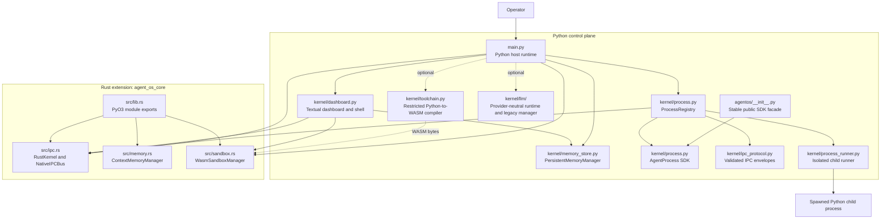

### Runtime Ownership

| Concern | Primary owner | Notes |
| --- | --- | --- |
| Boot, shutdown, shell commands | `main.py` | Creates shared services and runs dashboard tasks. |
| Dynamic process records | `kernel/process.py` | PID allocation, lifecycle, cleanup, supervision, telemetry snapshots. |
| Structured IPC protocol | `kernel/ipc_protocol.py` | Protocol `0.1`, message types, validation, JSON serialization, errors. |
| Mailbox transport | `src/ipc.rs` | Tokio bounded channels, direct and capability fallback routing, metrics. |
| Persistent process memory | `kernel/memory_store.py` | Hot/warm/cold records, JSONL persistence, snapshots, deterministic recall. |
| Native page-table primitive | `src/memory.rs` | Separate Rust-exported in-memory paging API. It is not the active process registry store. |
| Isolated subprocess adapter | `kernel/process_runner.py` | Spawn-safe runner, queue bridge endpoints, local `IsolatedMemory`. |
| WASM execution | `src/sandbox.rs` | Wasmtime engine, fuel accounting, memory limit, execution metrics. |
| Dashboard telemetry | `kernel/dashboard.py` | Polls bus, memory, sandbox, and process snapshots every `0.1` seconds. |

## Runtime Lifecycle

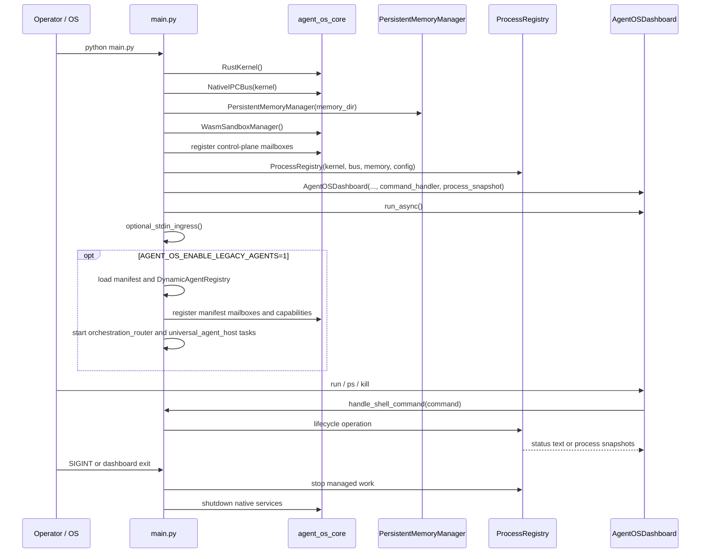

The standard boot path constructs:

1. `RustKernel`
2. `NativeIPCBus`
3. Python `PersistentMemoryManager`
4. Rust `WasmSandboxManager`
5. Control-plane mailboxes
6. `ProcessRegistry`
7. `AgentOSDashboard`

`AGENT_OS_PROCESS_ISOLATION` selects the default execution mode for dynamic
agents: `in-process` or spawned child `process` mode.

## Process Lifecycle

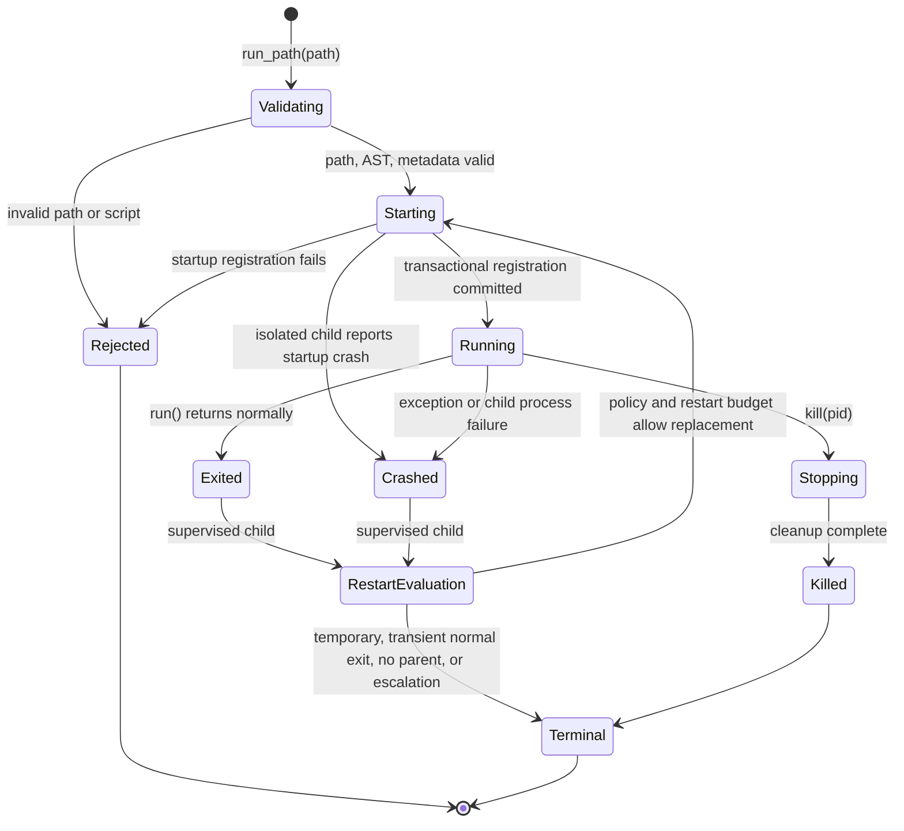

### Startup Transaction

`ProcessRegistry.run_path()` resolves and validates the script under
`AGENT_OS_PROCESS_ROOT`, restricts imports, allocates a PID, and registers
runtime resources. Registration is transactional:

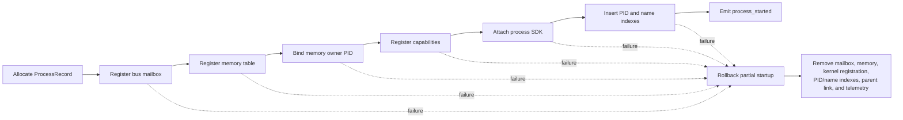

Runtime cleanup intentionally differs from startup rollback. A crashed, exited,
or killed process keeps its `ProcessRecord` so `ps` and the dashboard can show
terminal state and error context, while active mailbox, memory table, and kernel
capabilities are unregistered.

### Execution Modes

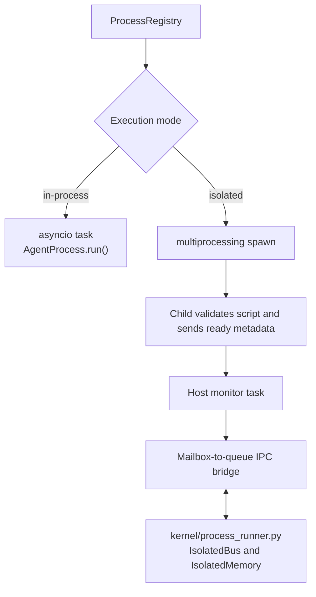

Trusted in-process agents receive the full registry attachment and can spawn or
monitor children. Isolated agents run in a separate Python process with a
minimal environment and queue-backed bus adapter. Process mode is isolation,
not a complete security sandbox.

## IPC Flow

Structured IPC is a Python protocol layered on the Rust mailbox transport.
Every envelope includes source and target PIDs, protocol version, message ID,
optional correlation ID, timestamp, priority, payload, and optional expiry.

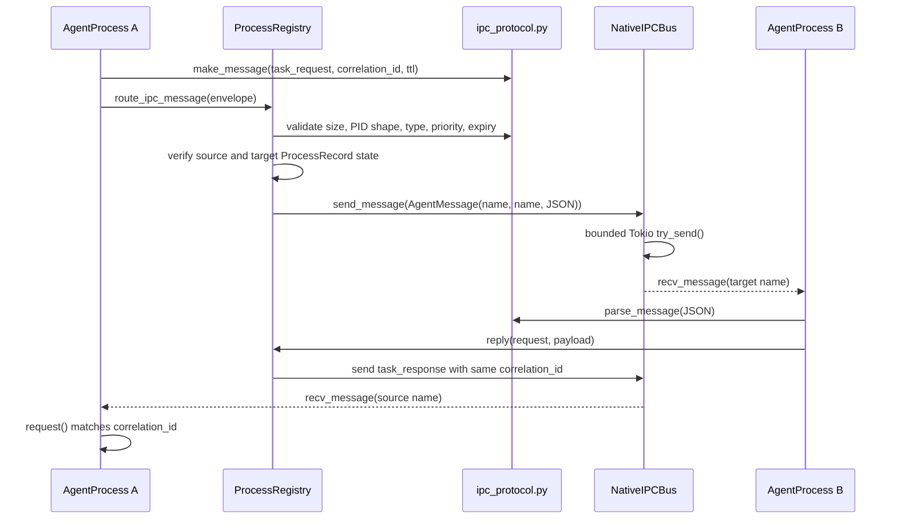

Routing failures return structured `ErrorMessage` values. Important protocol
codes include `target_not_found`, `mailbox_full`, `timeout`, `invalid_message`,
`process_dead`, and `payload_too_large`. Mailbox backpressure is preserved as
`mailbox_full`; it is not collapsed into generic validation failure.

### Isolated IPC Bridge

```mermaid
flowchart LR
    SRC["Host or agent"] --> REG["ProcessRegistry.route_ipc_message()"]
    REG --> BUS["NativeIPCBus target mailbox"]
    BUS --> MON["Host monitor task"]
    MON --> IN["multiprocessing child_inbox"]
    IN --> IBUS["IsolatedBus.recv_message()"]
    IBUS --> CHILD["Isolated AgentProcess"]
    CHILD --> OBUS["IsolatedBus.send_message()"]
    OBUS --> OUT["multiprocessing child_outbox"]
    OUT --> BRIDGE["ProcessRegistry._bridge_child_ipc()"]
    BRIDGE --> REG
```

The host remains authoritative for PID routing and telemetry. Isolated
processes exchange serialized envelopes through queues; the host reparses and
routes outbound envelopes through the same registry path used by trusted
agents.

## Supervision Flow

Agents form parent-child trees through `spawn_child()`. The registry owns tree
links, crash detection, restart policy evaluation, restart limits, cleanup, and
structured supervision events.

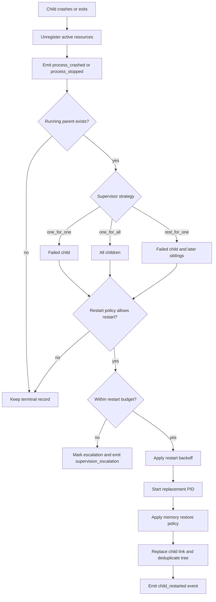

Supported supervisor strategies:

| Strategy | Restart set |
| --- | --- |
| `one_for_one` | Failed child only |
| `one_for_all` | Every child |
| `rest_for_one` | Failed child and siblings started after it |

Supported child restart policies:

| Policy | Behavior |
| --- | --- |
| `permanent` | Restart on normal exit or crash |
| `transient` | Restart only after abnormal failure |
| `temporary` | Never restart |

Restart storms are bounded by `max_restarts` within
`restart_window_seconds`. `restart_backoff_seconds` delays replacement
attempts. Parent termination cascades to live descendants.

## Memory Flow

The active dynamic-process store is Python `PersistentMemoryManager`.
`AgentProcess.remember()`, `recall()`, `forget()`, and `memory_stats()` delegate
to this manager when the agent runs in trusted mode.

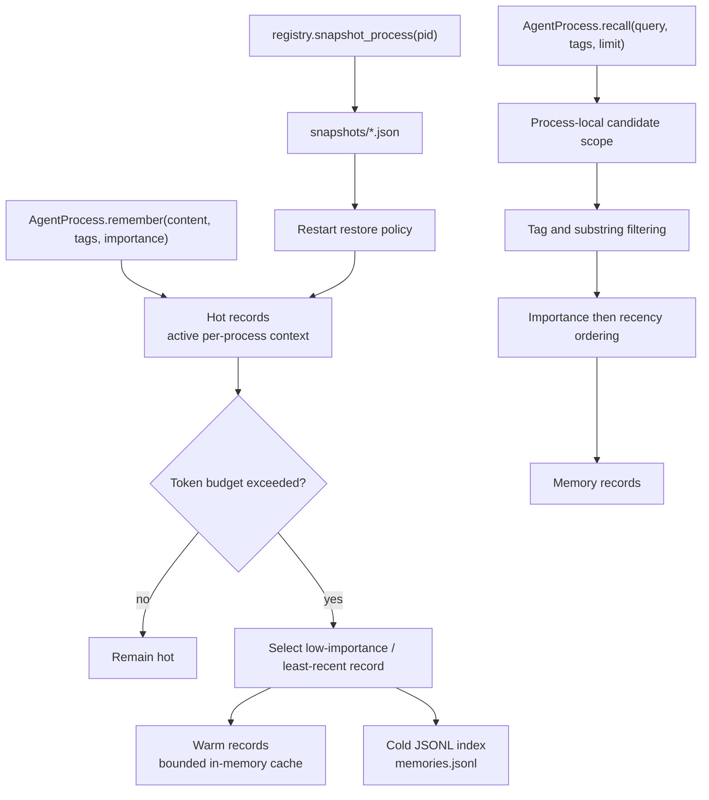

Persistent recall is scoped by `process_name`; one process does not search
another process's records. Cold records are stored in
`.agent_os/memory/memories.jsonl` by default. Snapshot files contain hot
records, warm/cold references, token usage, timestamp, PID, and process name.

Supported supervised restart restore policies:

| Policy | Behavior |
| --- | --- |
| `none` | Start with a fresh active table |
| `hot_only` | Restore hot snapshot records only |
| `latest_snapshot` | Restore latest or explicitly tracked snapshot |
| `persistent_recall` | Recall persisted records and append them to the replacement table |

### Memory Boundaries

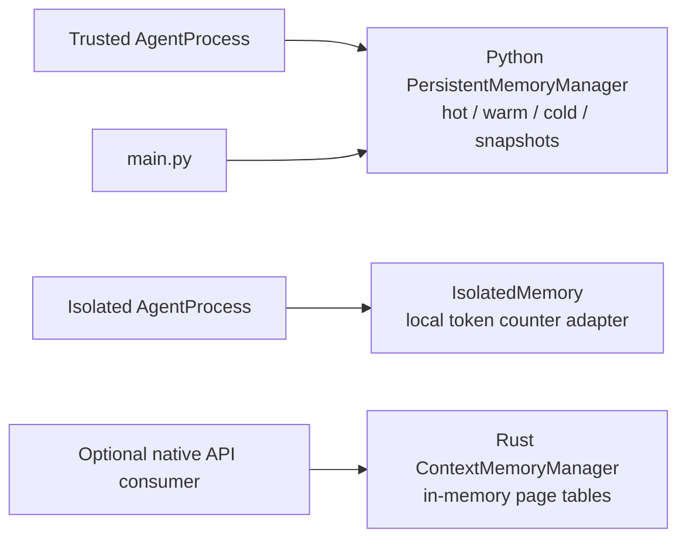

`src/memory.rs` remains a separate Rust-exported native page-table primitive.
The current `main.py` process registry is wired to Python
`PersistentMemoryManager` because supervision restore and disk-backed recall
require the richer persistence API. An isolated child receives a local
`IsolatedMemory` adapter; persistent storage and telemetry remain host-owned.

## Dashboard Integration

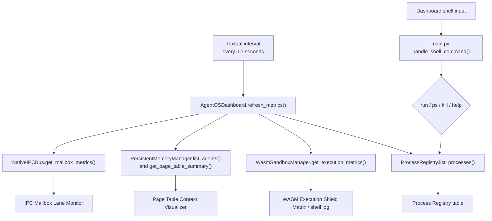

The dashboard combines four telemetry sources:

| Pane | Source | Visible signals |
| --- | --- | --- |
| Status bar | Rust kernel and Python memory manager | Registered agents, active tokens, heartbeat |
| IPC monitor | Rust `NativeIPCBus` | Queue depth, capacity, routing method |
| Memory visualizer | Python `PersistentMemoryManager` | Active tokens, active frames, paged frames |
| WASM log | Rust `WasmSandboxManager` and shell handler | Execution status, fuel use, errors, command output |
| Process table | Python `ProcessRegistry` | PID tree, state, mode, parent, children, restart count, strategy, memory, IPC counters |

`ProcessRegistry.list_processes()` reaps finished isolated children before
returning snapshots, keeping dashboard state aligned with subprocess state.

## Rust/Python Boundary

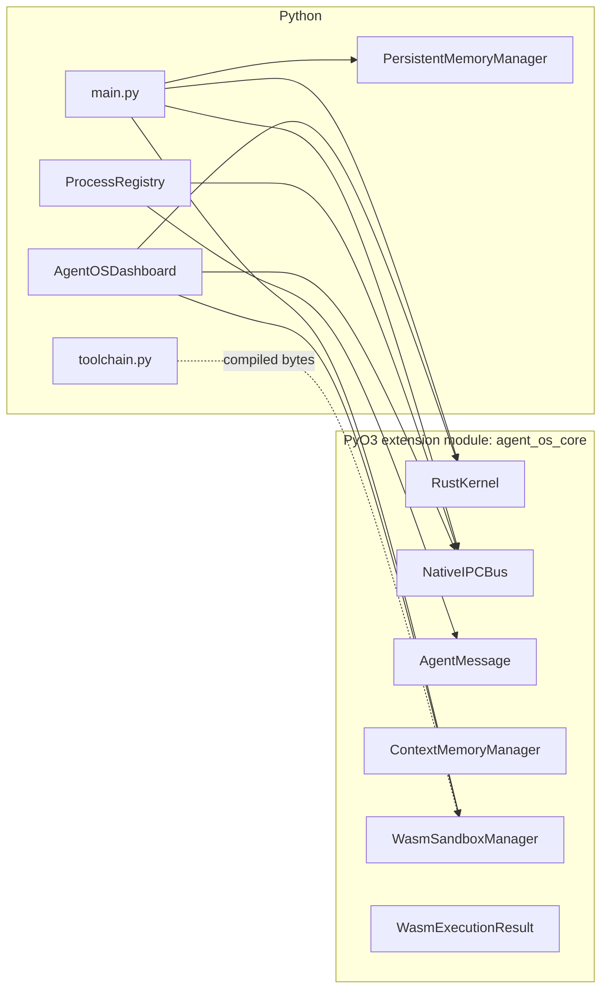

`src/lib.rs` exposes these Rust classes:

| Rust export | Python role |
| --- | --- |
| `AgentMessage` | JSON-validated transport envelope used by the native bus |
| `RustKernel` | Registered-agent set, capability map, shutdown flag |
| `NativeIPCBus` | Bounded mailbox registration, send, async receive, queue metrics |
| `MemoryPage` | Native page-table record |
| `ContextMemoryManager` | Native in-memory paging primitive |
| `WasmExecutionResult` | WASM outcome, stdout, error, fuel consumed |
| `WasmSandboxManager` | Wasmtime execution and bounded execution metrics |

The Rust IPC bus owns a Tokio runtime on a dedicated worker thread. Python
receives `asyncio.Future` objects; Rust completes them safely with
`call_soon_threadsafe`. Native mailbox sends use bounded `try_send`, so
backpressure is observable immediately by Python.

The WASM sandbox uses Wasmtime with fuel accounting, a fixed maximum linear
memory size, captured stdout, and no general CPython compatibility layer.
`kernel/toolchain.py` compiles a deliberately small Python AST subset into
standalone WASM bytes.

## Component Dependency Map

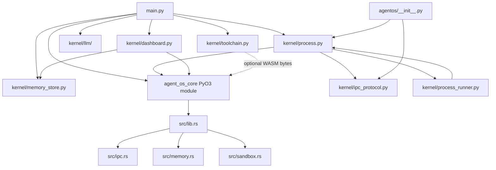

### File-Level Responsibilities

| File | Depends on | Responsibility |
| --- | --- | --- |
| `agentos/__init__.py` | `kernel.process`, `kernel.ipc_protocol` | Stable public SDK facade for agent authors |
| `main.py` | `agent_os_core`, `kernel.dashboard`, `kernel.memory_store`, `kernel.process` | Runtime composition, shell commands, optional legacy orchestration |
| `kernel/process.py` | `kernel.ipc_protocol`, native `AgentMessage` | Agent SDK, process registry, isolation bridge, supervision, process telemetry |
| `kernel/process_runner.py` | `kernel.process` | Spawned child bootstrap and queue-backed adapters |
| `kernel/ipc_protocol.py` | Python standard library | Structured protocol model and validation |
| `kernel/memory_store.py` | Python standard library | Persistent hot/warm/cold memory and snapshots |
| `kernel/dashboard.py` | Textual, Rich | Terminal UI and telemetry rendering |
| `kernel/llm/` | Python standard library, optional legacy provider dependencies | Provider-neutral LLM requests, providers, runtime facade, and structured events |
| `kernel/toolchain.py` | Python AST, optional Python `wasmtime` assembler | Restricted Python-to-WASM compilation |
| `src/lib.rs` | `src/ipc.rs`, `src/memory.rs`, `src/sandbox.rs` | PyO3 extension exports |
| `src/ipc.rs` | Tokio, PyO3, Serde JSON | Native kernel capability registry and mailbox transport |
| `src/memory.rs` | PyO3, Serde JSON | Native in-memory page tables |
| `src/sandbox.rs` | Wasmtime, WASI, PyO3 | WASM execution and telemetry |

## Operational Summary

The runtime has three distinct execution layers:

1. Python control plane: lifecycle, protocol semantics, supervision, persistent
   memory, dashboard.
2. Rust native services: bounded mailbox transport, capability registry, WASM
   execution, optional native page tables.
3. Agent execution: trusted asyncio tasks or isolated spawned Python child
   processes connected through queue bridges.

This separation keeps lifecycle policy inspectable in Python while moving
bounded concurrency and sandbox execution into Rust.
